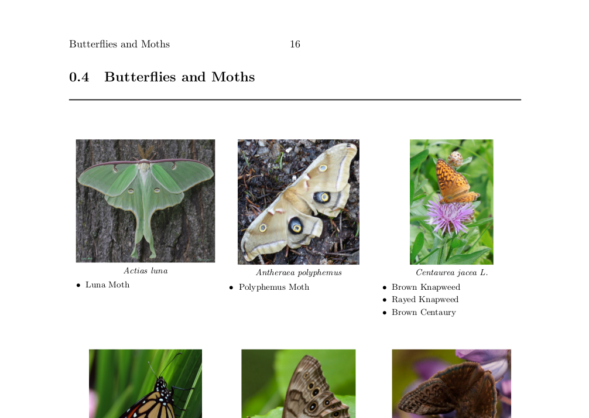

# new-hampshire-wildlife-guide

This is a two part project that first scrapes wildlife data from [here](http://amc-nh.org/resources/guides/) then assembles a New Hampshire wildlife guide PDF.

## Output

Here's a screenshot of what the guide looks like.

The final output is too big to host on GitHub (300+MB of wildlife photographs) but is hosted [here](https://drive.google.com/open?id=0B43OdhDUo9n7anRmcnI0aWtEY00) on my Google Drive.

## To use

### Web scraper

The first part of generating the wildlife guide involves scraping the host site for all of its images and textual information on the wildlife. The script to do this is the `scraper.py` python file. This will save all the scraped data to the `data` folder.

* `python scraper.py`

### LaTeX guide builder

The second part is to assemble all the scraped data into a PDF using Lua and LaTeX (LuaTeX). The assembly script is located inside the `guide.tex` file. To run this script, you'll need to have LuaTeX installed as well as all the LaTeX packages used in `guide.tex`.

* `lualatex guide.tex`
* `./cleanup.sh` (optional)

